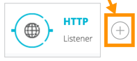
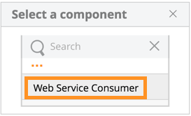
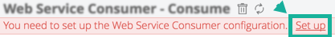

= To Configure the Web Service Consumer
:keywords: web service consumer, configure
:toc:
:toc-title: Page Contents

toc::[]

In Flow Designer, you can create an API from a WSDL that is on your 
computer or at a URL. 

. After creating a trigger such as HTTP, click the plus sign:
+

+
. Click *Web Service Consumer*.
+

+
. Click *Set up*.
+

+
. In Web Service Consumer Configuration, specify a WSDL location. For example, on a Mac OSX computer: +
`file:///Users/YOURUSERNAME/FOLDERNAME/WSDLFILENAME.wsdl`
+
Or in Windows:
`file:///DRIVELETTER/FOLDERNAME/WSDLFILENAME.wsdl`
+
. Specify the service, such as `SOAP`.
. Specify the port, such as 8082.
+
For information on non-required fields see link:/connectors/web-service-consumer-documentation#parameters-2[Configuration Parameters].
+
. Click *Test* to test the connection to your WSDL file.
. Click *Save* to exit.
. In the connector properties page, specify *Operation* as the `Consume` value.
+
Flow Designer automatically runs your project. Success appears as:
+

== About Taking a Project into Anypoint Studio 7

After developing your project in Flow Designer, if you want to move your project to 
Studio, this section provides the necessary POM file modifications to enable use of 
the Web Service Consumer in Studio 7.

The configuration for the web service consumer is basically a container for the connection. It only has one optional attribute: the *encoding*. The provided encoding in use in all requests and responses is managed by the link:/connectors/wsc-to-consume[Consume] operation. If no encoding is specified, the web service consumer uses Mule's default encoding.

Before adding the Web Service Consumer connector to your Studio 7 project, add the following to your 
project's `pom.xml` file:

[source,xml,linenums]
----
<dependency>
  <groupId>org.mule.modules</groupId>
  <artifactId>mule-module-wsc</artifactId>
  <version>${project.version}</version>
  <classifier>mule-plugin</classifier>
  <scope>provided</scope>
</dependency>
----

Configuration topics:

* link:/connectors/wsc-to-configure-security[To Configure Security]
* link:/connectors/wsc-to-create-connection[To Create a Connection]

[source,xml,linenums]
----
<wsc:config name="config"  encoding="UTF-8">
     <wsc:connection … />
</wsc:config>
----

== XML Example

The following XML example shows the use of the Web Service Consumer connector, DataWeave for echoing text, and an
HTTP Listener:

[source,xml,linenums]
----
<?xml version="1.0" encoding="UTF-8"?>

<mule xmlns:doc="http://www.mulesoft.org/schema/mule/documentation"
      xmlns:httpn="http://www.mulesoft.org/schema/mule/httpn"
      xmlns:wsc="http://www.mulesoft.org/schema/mule/wsc"
      xmlns="http://www.mulesoft.org/schema/mule/core" 
      xmlns:xsi="http://www.w3.org/2001/XMLSchema-instance" 
      xsi:schemaLocation="http://www.mulesoft.org/schema/mule/core 
      http://www.mulesoft.org/schema/mule/core/current/mule.xsd
          http://www.mulesoft.org/schema/mule/wsc 
          http://www.mulesoft.org/schema/mule/wsc/current/mule-wsc.xsd
http://www.mulesoft.org/schema/mule/httpn 
http://www.mulesoft.org/schema/mule/httpn/current/mule-httpn.xsd">

    <wsc:config name="config">
        <wsc:connection wsdlLocation="http://localhost:${servicePort}/server?wsdl" 
             service="TestService" port="TestPort" soapVersion="${soapVersion}">
            <reconnect blocking="false"/>
        </wsc:connection>
    </wsc:config>
    
    <httpn:listener-config name="HTTP_Listener_config" doc:name="HTTP Listener config" >
		<httpn:listener-connection host="0.0.0.0" port="8081" />
	</httpn:listener-config>
	<flow name="echoWithHeadersOperation">
        <httpn:listener config-ref="HTTP_Listener_config" path="/" doc:name="Listener" />
		<wsc:consume config-ref="config" operation="echoWithHeaders">
            <wsc:message>
                <wsc:body>
                #[
                %dw 1.0
                %output application/xml
                %namespace con http://service.ws.extension.mule.org/
                ---
                con#echoWithHeaders: {
                   text: "test"
                }]
                </wsc:body>
                <wsc:headers>
                #[
                %dw 1.0
                %output application/xml
                %namespace con http://service.ws.extension.mule.org/
                ---
                "headers": {
                    con#headerIn: "Header In Value",
                    con#headerInOut: "Header In Out Value"
                }]
                </wsc:headers>
            </wsc:message>
        </wsc:consume>
    </flow>
</mule>
----

== See Also

* link:/connectors/web-service-consumer[Web Service Consumer Connector]
* link:/connectors/wsc-to-consume[To Consume from the Connector]
